# GitHub Actions CI/CD Setup Guide (OIDC)

**Authentication Method:** OIDC (OpenID Connect) - Secure, No Secrets Required ✅  
**Last Updated:** January 2025  
**Status:** Production Ready

---

## 🎯 What This Does

Automatically deploys your O2C Enhanced dbt project to Snowflake whenever you:
- ✅ Push code to `main` branch
- ✅ Manually trigger the workflow
- ✅ On schedule (daily at 6 AM UTC)

**No private keys stored in GitHub!** OIDC uses temporary tokens for authentication.

---

## 📋 Complete Setup Checklist

### Phase 1: Snowflake Configuration (5 minutes)

- [ ] **Step 1:** Run `GITHUB_ACTIONS_SETUP.sql` in Snowflake
  ```bash
  snowsql -f .github/GITHUB_ACTIONS_SETUP.sql
  ```
  
- [ ] **Step 2:** Verify service user created
  ```sql
  DESC USER github_actions_service_user;
  ```
  
- [ ] **Step 3:** Note your Snowflake account identifier
  - Format: `abc12345.us-east-1` or `orgname-accountname`
  - Find it: `SELECT CURRENT_ACCOUNT();` in Snowflake

### Phase 2: GitHub Configuration (3 minutes)

- [ ] **Step 1:** Create GitHub Environment
  1. Go to your repository in GitHub
  2. Navigate to **Settings** → **Environments**
  3. Click **New environment**
  4. Name: `production`
  5. (Optional) Add protection rules:
     - ✅ Required reviewers
     - ✅ Wait timer: 0 minutes (or longer for safety)
     - ✅ Deployment branches: `main` only

- [ ] **Step 2:** Add GitHub Secret
  1. Go to **Settings** → **Secrets and variables** → **Actions**
  2. Click **New repository secret**
  3. Name: `SNOWFLAKE_ACCOUNT`
  4. Value: Your Snowflake account identifier (from Phase 1, Step 3)
  5. Click **Add secret**

- [ ] **Step 3:** Verify Workflow File
  - File should exist: `.github/workflows/dbt_o2c_deploy.yml` ✅
  - Check `permissions:` section includes `id-token: write` ✅

### Phase 3: Testing (5 minutes)

- [ ] **Step 1:** Manual Trigger Test
  1. Go to **Actions** tab in GitHub
  2. Select **O2C Enhanced - dbt Deploy (OIDC)** workflow
  3. Click **Run workflow** dropdown
  4. Select branch: `main`
  5. Click **Run workflow** button
  6. Watch the logs in real-time

- [ ] **Step 2:** Verify in Snowflake
  ```sql
  -- Check if tables were created/updated
  SELECT TABLE_SCHEMA, TABLE_NAME, ROW_COUNT, 
         LAST_ALTERED, CREATED
  FROM EDW.INFORMATION_SCHEMA.TABLES
  WHERE TABLE_SCHEMA LIKE 'O2C_ENHANCED%'
  ORDER BY LAST_ALTERED DESC;
  
  -- Check semantic views
  SELECT * FROM EDW.INFORMATION_SCHEMA.VIEWS
  WHERE TABLE_SCHEMA = 'O2C_ENHANCED_SEMANTIC_VIEWS';
  ```

- [ ] **Step 3:** Test Automatic Trigger
  ```bash
  # Make a small change
  echo "# CI/CD test" >> O2C/dbt_o2c_enhanced/README.md
  
  # Commit and push
  git add .
  git commit -m "test: trigger CI/CD pipeline"
  git push origin main
  ```
  
  Watch the Actions tab - workflow should start automatically!

---

## 🔍 How OIDC Works

### Traditional Private Key Flow (❌ Not Used)
```
GitHub → Stores private key → Authenticates with Snowflake
         ⚠️ Risk: Key in plaintext in GitHub secrets
```

### OIDC Flow (✅ What We're Using)
```
GitHub Actions runs
    ↓
GitHub generates temporary OIDC token
    ↓
Token sent to Snowflake
    ↓
Snowflake validates token against configured issuer/subject
    ↓
Snowflake grants temporary access
    ↓
dbt runs with temporary credentials
    ↓
Token expires (no long-term secrets stored!)
```

**Benefits:**
- 🔒 No secrets stored in GitHub
- 🔄 Tokens auto-expire
- 🎯 Fine-grained subject matching
- ✅ Recommended by Snowflake

---

## 📊 Workflow Visualization

```mermaid
graph TD
    A[Push to main] --> B[GitHub Actions Triggered]
    B --> C[OIDC Token Generated]
    C --> D[Authenticate with Snowflake]
    D --> E[Deploy O2C Enhanced Core]
    E --> F{Tests Pass?}
    F -->|Yes| G[Deploy Semantic Views]
    F -->|No| H[Fail & Alert]
    G --> I{Tests Pass?}
    I -->|Yes| J[✅ Deployment Complete]
    I -->|No| H
    H --> K[Check Logs]
```



---

## 🛠️ Workflow Features

### Automatic Triggers
1. **On Push to Main**
   - Triggered when changes pushed to `main` branch
   - Only runs if files in `O2C/dbt_o2c_enhanced/**` changed
   
2. **Manual Trigger**
   - Click "Run workflow" in Actions tab
   - Useful for testing or emergency deployments
   
3. **Scheduled**
   - Runs daily at 6 AM UTC
   - Ensures fresh data even without code changes

### Two-Job Pipeline
```
Job 1: deploy-o2c-enhanced (Core Models)
    ├── Install dependencies
    ├── Run dbt build
    ├── Run dbt test
    └── Generate docs
         ↓
Job 2: deploy-semantic-views (Semantic Layer)
    ├── Install dependencies
    ├── Deploy semantic views
    └── Verify deployment
         ↓
Job 3: deployment-summary
    └── Generate summary report
```

### Built-in Features
- ✅ Dependency caching for faster runs
- ✅ Detailed logging for debugging
- ✅ Automatic failure notifications
- ✅ Deployment summary in GitHub UI
- ✅ Sequential job execution (core → semantic)

---

## 📝 Configuration Files

### Main Workflow File
`.github/workflows/dbt_o2c_deploy.yml`
- Defines the CI/CD pipeline
- Configures OIDC authentication
- Sets up dbt profiles dynamically

### Snowflake Setup SQL
`.github/GITHUB_ACTIONS_SETUP.sql`
- Creates service user with OIDC
- Configures role and permissions
- Sets up audit logging

### This Guide
`.github/README_CICD_SETUP.md`
- Complete setup instructions
- Troubleshooting guide
- Best practices

---

## 🚨 Troubleshooting

### Issue: "Permission denied" errors in workflow

**Cause:** Workflow doesn't have `id-token: write` permission

**Solution:** Verify workflow file has:
```yaml
permissions:
  id-token: write
  contents: read
```

---

### Issue: "Authentication failed" error

**Possible Causes:**
1. GitHub environment name doesn't match OIDC subject
2. Snowflake account secret is incorrect
3. Service user not created properly

**Solution:**
```sql
-- Verify service user exists
DESC USER github_actions_service_user;

-- Check OIDC configuration
SELECT * FROM SNOWFLAKE.ACCOUNT_USAGE.USERS
WHERE NAME = 'GITHUB_ACTIONS_SERVICE_USER';

-- Verify subject matches
-- Should be: repo:sfc-gh-apanda/poc_dbt_projects_honeywell_ps_india:environment:production
```

---

### Issue: Workflow runs but models don't update

**Cause:** Role doesn't have proper permissions

**Solution:**
```sql
-- Grant missing permissions
USE ROLE ACCOUNTADMIN;
GRANT ALL ON SCHEMA EDW.O2C_ENHANCED_CORE TO ROLE GITHUB_CICD_ROLE;
GRANT ALL ON FUTURE TABLES IN SCHEMA EDW.O2C_ENHANCED_CORE TO ROLE GITHUB_CICD_ROLE;
```

---

### Issue: "dbt deps failed" error

**Cause:** Missing dependencies or incorrect dbt version

**Solution:** Check workflow uses correct Python and dbt versions:
```yaml
- name: Set up Python
  uses: actions/setup-python@v4
  with:
    python-version: '3.11'  # ← Verify this matches your local

- name: Install dbt-snowflake
  run: pip install dbt-snowflake  # ← Add version if needed: ==1.7.0
```

---

### Issue: Scheduled workflow doesn't run

**Cause:** Workflow is disabled or cron syntax is wrong

**Solution:**
1. Go to Actions tab
2. Find the workflow
3. Click "Enable workflow" if disabled
4. Verify cron syntax: `'0 6 * * *'` = 6 AM UTC daily

---

## 🎯 Advanced Configuration

### Add PR Checks (Test Before Merge)

Add this job to the workflow:

```yaml
  pr-check:
    name: PR Check - Test Changes
    runs-on: ubuntu-latest
    if: github.event_name == 'pull_request'
    
    steps:
      - uses: actions/checkout@v4
      - uses: actions/setup-python@v4
        with:
          python-version: '3.11'
      - run: pip install dbt-snowflake
      - uses: snowflakedb/snowflake-cli-action@v2.0
        with:
          use-oidc: true
      - name: Configure dbt
        run: |
          mkdir -p ~/.dbt
          # ... profiles.yml config ...
      - name: Test Changed Models Only
        working-directory: ./O2C/dbt_o2c_enhanced
        run: |
          dbt deps
          dbt build --select state:modified+
```

Then update workflow trigger:
```yaml
on:
  push:
    branches: [main]
  pull_request:  # ← Add this
    branches: [main]
```

---

### Add Slack Notifications

1. Create Slack webhook URL
2. Add as GitHub secret: `SLACK_WEBHOOK_URL`
3. Add this step at the end of jobs:

```yaml
      - name: Notify Slack on Failure
        if: failure()
        run: |
          curl -X POST ${{ secrets.SLACK_WEBHOOK_URL }} \
            -H 'Content-Type: application/json' \
            -d '{
              "text": "❌ O2C Enhanced deployment failed",
              "blocks": [
                {
                  "type": "section",
                  "text": {
                    "type": "mrkdwn",
                    "text": "*Deployment Failed*\nWorkflow: ${{ github.workflow }}\nRun: ${{ github.run_id }}"
                  }
                }
              ]
            }'
```

---

### Monitor Snowflake Credits Usage

Add to audit log:

```sql
-- Create credit usage tracking
CREATE OR REPLACE VIEW EDW.O2C_AUDIT.V_CICD_CREDIT_USAGE AS
SELECT 
    DATE(START_TIME) AS usage_date,
    WAREHOUSE_NAME,
    USER_NAME,
    COUNT(*) AS queries_run,
    SUM(CREDITS_USED_CLOUD_SERVICES) AS credits_used,
    AVG(EXECUTION_TIME) AS avg_execution_ms
FROM SNOWFLAKE.ACCOUNT_USAGE.QUERY_HISTORY
WHERE USER_NAME = 'GITHUB_ACTIONS_SERVICE_USER'
  AND START_TIME >= DATEADD('day', -30, CURRENT_DATE())
GROUP BY usage_date, WAREHOUSE_NAME, USER_NAME
ORDER BY usage_date DESC;

-- Check daily
SELECT * FROM EDW.O2C_AUDIT.V_CICD_CREDIT_USAGE LIMIT 10;
```

---

## 📈 Monitoring & Observability

### GitHub Actions Monitoring

**View Run History:**
1. Go to Actions tab
2. Select workflow
3. View all runs with status

**Metrics to Track:**
- Run duration (aim for < 10 minutes)
- Success rate (aim for > 95%)
- Frequency of failures
- Cost per run (Snowflake credits)

### Snowflake Monitoring

```sql
-- View CI/CD activity
SELECT 
    DATE(START_TIME) AS run_date,
    COUNT(*) AS total_runs,
    SUM(CASE WHEN ERROR_CODE IS NULL THEN 1 ELSE 0 END) AS successful_runs,
    AVG(TOTAL_ELAPSED_TIME / 1000) AS avg_duration_seconds
FROM SNOWFLAKE.ACCOUNT_USAGE.QUERY_HISTORY
WHERE USER_NAME = 'GITHUB_ACTIONS_SERVICE_USER'
  AND START_TIME >= DATEADD('day', -7, CURRENT_DATE())
GROUP BY run_date
ORDER BY run_date DESC;
```

---

## ✅ Best Practices

### 1. Use Environments for Protection
- ✅ Create `production` environment
- ✅ Require manual approval for production
- ✅ Limit to `main` branch only

### 2. Monitor Credit Usage
- ✅ Track Snowflake credits consumed by CI/CD
- ✅ Set up alerts for unusual spikes
- ✅ Use appropriate warehouse size (start with SMALL)

### 3. Optimize Workflow Speed
- ✅ Use caching for Python dependencies
- ✅ Run only changed models on PRs
- ✅ Parallelize independent jobs

### 4. Security
- ✅ Never commit credentials to Git
- ✅ Use environment-specific secrets
- ✅ Rotate OIDC subjects periodically
- ✅ Use least-privilege role (GITHUB_CICD_ROLE, not ACCOUNTADMIN)

### 5. Testing
- ✅ Test in PR before merging
- ✅ Use manual trigger for testing
- ✅ Keep main branch always deployable

---

## 📞 Support & Resources

### Documentation
- [Snowflake OIDC CI/CD Guide](https://docs.snowflake.com/en/developer-guide/snowflake-cli/cicd/integrate-ci-cd)
- [GitHub Actions Documentation](https://docs.github.com/en/actions)
- [dbt Documentation](https://docs.getdbt.com)

### Internal Resources
- **Workflow File:** `.github/workflows/dbt_o2c_deploy.yml`
- **Setup SQL:** `.github/GITHUB_ACTIONS_SETUP.sql`
- **Monitoring Dashboard:** `O2C/docs_o2c_enhanced/O2C_ALL_IN_ONE_MONITORING.sql`

---

## 🎉 Success Criteria

Your CI/CD is working perfectly when:
- ✅ Workflow runs automatically on every push to main
- ✅ Success rate is > 95%
- ✅ Deployment completes in < 10 minutes
- ✅ No authentication errors
- ✅ All dbt tests pass
- ✅ Tables/views update in Snowflake
- ✅ Team can trigger manual deployments easily

---

**Questions?** Check the troubleshooting section or review workflow run logs in the Actions tab!

